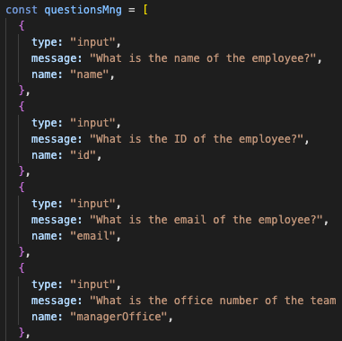

# **Create Your Team**

## Description

A user looking to build a quick webpage listing their team of engineers will be able to do so in a matter of minutes. The user will be prompted a set of questions and then a html file will be created.

## Table of Contents

- [Description](#description)
- [Installation](#installation-instructions)
- [Usage](#usage)
- [License](#license)
- [Tests](#test-instructions)
- [Questions](#questions)
- [Links](#links)

## Installation Instructions

You can install it using your terminal. This program uses Inquirer and Jest testing.

## Usage

To begin clone down the repo for Create Your Team. Using any code editor you can then install the necessary dependencies by running 'npm i inquirer' and 'npm i -y' in the terminal. Answer the questions that are prompted in the terminal. Then your custom HTML file will be created inside the dist folder.

## Test Instructions

Using npm run test in your terminal you can see how the test driven development was passed.

## Questions

If you have any questions: jessgiannini@gmail.com

Or visit [My GitHub](https://github.com/jessgiannini)

## Links

- [Link to Portfolio Site](https://jessgiannini.github.io/WebDeveloperPortfolio/)
- [Link to Github](https://github.com/jessgiannini)
- [Link to LinkedIn](https://www.linkedin.com/in/jessica-aletta-giannini-155b1310/)

## Video Link

[Link](https://drive.google.com/file/d/1scIa_byt50M3pxj08pYQvCjJkTtUGnMM/view)
